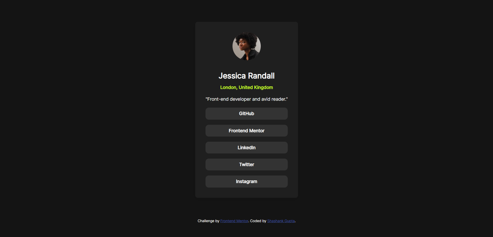

# Frontend Mentor - Social links profile solution

This is a solution to the [Social links profile challenge on Frontend Mentor](https://www.frontendmentor.io/challenges/social-links-profile-UG32l9m6dQ). Frontend Mentor challenges help you improve your coding skills by building realistic projects.

## Table of contents

- [Overview](#overview)
  - [The challenge](#the-challenge)
  - [Screenshot](#screenshot)
  - [Links](#links)
- [My process](#my-process)
  - [Built with](#built-with)
  - [What I learned](#what-i-learned)
  - [Continued development](#continued-development)
  - [Useful resources](#useful-resources)
- [Author](#author)
- [Acknowledgments](#acknowledgments)

## Overview

### The challenge

Users should be able to:

- See hover and focus states for all interactive elements on the page

### Screenshot



### Links

- Solution URL: [https://github.com/Shashank23codes/social-links-profile-card](https://github.com/Shashank23codes/social-links-profile-card)
- Live Site URL: [https://shashank23codes.github.io/social-links-profile-card/](https://shashank23codes.github.io/social-links-profile-card/)

## My process

### Built with

- Semantic HTML5 markup
- CSS custom properties
- Flexbox
- Mobile-first workflow

### What I learned

This project helped me practice using custom properties for colors and implementing hover and focus states for interactive elements. Here's an example of the hover effect I implemented:

```css
.social-links a:hover {
  background-color: var(--Green);
  color: var(--Grey-900);
  transition: color 0.3s ease;
  cursor: pointer;
}
```

### Continued development

I plan to continue improving my skills in responsive design and accessibility to ensure my projects are user-friendly across all devices.

### Useful resources

- [CSS Tricks - A Complete Guide to Flexbox](https://css-tricks.com/snippets/css/a-guide-to-flexbox/) - This guide helped me understand Flexbox better and apply it effectively in this project.

## Author

- Frontend Mentor - [@Shashank23codes](https://www.frontendmentor.io/profile/Shashank23codes)
- Linkdin - [Shashank Gupta](https://www.linkedin.com/in/shashank-gupta-238a96209)

## Acknowledgments

Thanks to [Frontend Mentor](https://www.frontendmentor.io) for providing this challenge and helping me improve my front-end development skills.
